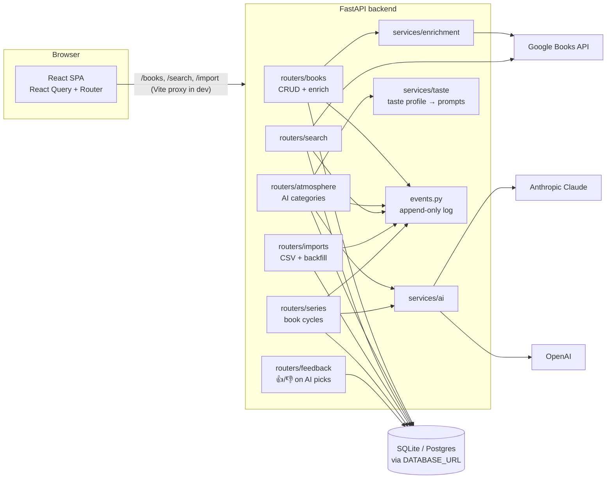
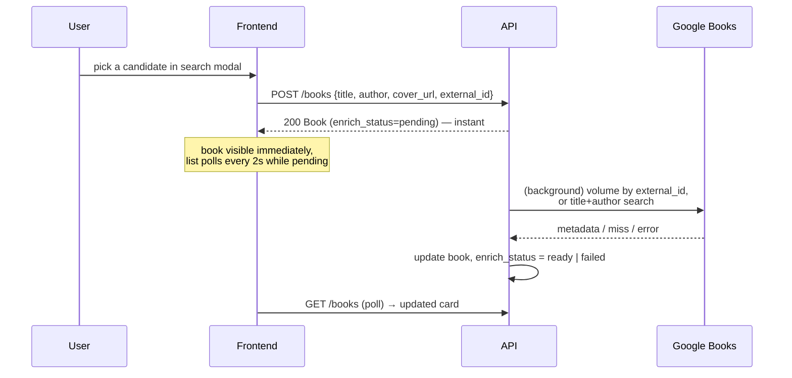

# Architecture

## Components



- **Frontend** never talks to external services directly; all traffic goes through the API.
- **React Query** owns all server state: cache keys are centralized in `src/queryKeys.js`,
  mutations invalidate by key prefix. No manual `fetch`/`useState` for server data.
- **Schema is owned by Alembic** (`alembic upgrade head`); `create_all` exists only in tests.
- **Event log** (`event` table) records every meaningful action. `detail` is stored as
  JSON (not a string), and AI events carry per-call metrics: provider, latency and token
  usage — so "what does a generation cost and which provider is faster" is answerable.
- **Observability**: JSON logs with a request id (also returned as `X-Request-ID`),
  a fail-fast check for required API keys at startup, rate limits on the expensive
  endpoints, and security headers — see `logging_setup.py`, `rate_limit.py`, `main.py`.

## Key flows

### Adding a book (background enrichment)



### AI atmosphere (unified for all categories)

```mermaid
sequenceDiagram
    participant F as Frontend
    participant B as routers/atmosphere
    participant AI as services/ai (Claude / OpenAI)

    F->>B: POST /books/{id}/atmosphere/{category}
    B->>AI: generator from CATEGORIES[category]
    AI-->>B: {source: PydanticModel} (structured outputs)
    B->>B: optional postprocess (music: resolve tracks in Spotify)
    B->>B: replace old AISelection rows<br/>(delete → flush → insert; unique constraint as safety net)
    B-->>F: {selections: [{source, payload, explanation}]}
    Note over F: same shape as GET —<br/>response goes straight into the query cache
```

Adding a category (stage 7: food, aroma) = a generator in `services/ai.py` + one entry in
`CATEGORIES` (backend) + one entry in `COPY`/`renderPayload` in `AtmosphereSection.jsx`.

**Music has an extra step.** Models routinely invent plausible track titles (Ólafur
Arnalds has no "Familiar Ground"), and such a track would end up on the book page and on
the printed card. So `CATEGORIES["music"]["postprocess"]` resolves every unique track in
Spotify — in one parallel pass that returns both canonical names (saved with the
atmosphere) and track URIs (used to create or refresh the book's playlist right away).
Tracks that don't resolve are dropped. Without Spotify credentials the step degrades to
"save as generated" — an unverified atmosphere beats an empty one.

## Runtime states and failure behaviour

Book states (shelf status, enrichment, passport, atmosphere, playlist) are independent
dimensions, and every external dependency is optional. Both are documented separately:
see [states-and-degradation.md](states-and-degradation.md).

The API contract is snapshotted in [openapi.json](openapi.json) — regenerate with
`python scripts/dump_openapi.py` (from `backend/`) after changing endpoints, so breaking changes show up
as a plain diff.

## Decisions worth knowing (short ADR log)

| Decision | Why | Revisit when |
|----------|-----|--------------|
| SQLite + WAL now, `DATABASE_URL` for Postgres | zero-ops local dev; WAL lets background writer coexist with UI reads | deploying multi-user |
| Structured outputs (Pydantic → provider schema) | eliminates JSON-parsing failures; validators reject unsafe colors/fonts at the boundary | — |
| Background enrichment via `BackgroundTasks` + status field | instant UX; pattern reused for future async AI generation | task queue needed (many users) |
| AI palette applied only if WCAG contrast ≥ 4.5:1 | AI colors go into inline styles; unreadable/unsafe values fall back to base theme | — |
| Two AI providers for the same category | learning goal: compare models side by side | cost optimization |
| `raw_metadata` stored but never returned by API | keeps a full copy for future re-parsing without leaking internals | — |
| Tracks resolved against Spotify **before** the atmosphere is saved | models invent titles; verifying at export time left them visible in the app and on printed cards | another catalog is added as a source |
| One resolve pass feeds both the atmosphere and the playlist | halves Spotify calls; the playlist is ready the moment the atmosphere is | playlists become per-user (stage 9) |
| Playlist refresh replaces items instead of recreating | the URL is printed as a QR code on cards — it must stay valid | — |
| Cooldown breaker instead of honouring a long Spotify `Retry-After` | a 429 with a ~21 h wait once froze the single worker; waiting is pointless, so we skip Spotify until the ban lifts and keep serving | — |
| Structured JSON logs + request id (`X-Request-ID`) | needed before publishing: filterable logs, one id ties a complaint to log lines | log shipping is set up |
| In-memory rate limiter instead of slowapi/Redis | one instance in production; a plain counter is enough and adds no dependency | scaling beyond one instance |
| Basic Auth (shared password) for the test deploy | real auth (stage 9) is a bigger task; this closes the service and the AI budget today | stage 9 lands |
| Series split into shared `series` + personal `userseries` | repeats the book/userbook split: a cycle exists objectively, the reading status does not | — |
| Books outside the shelf are plain catalog rows | a cycle needs "what's next" without inventing a placeholder entity; search finds them anyway | — |
| Series data entered by hand, never by AI | a survey found zero series data in Google Books and OpenLibrary; models invent volume numbers confidently | a reliable source appears |
| Feedback stored locally and injected into prompts | model APIs are stateless and cannot be taught our 👍/👎; the "taste memory" has to live on our side | profile outgrows a prompt (→ embeddings) |
