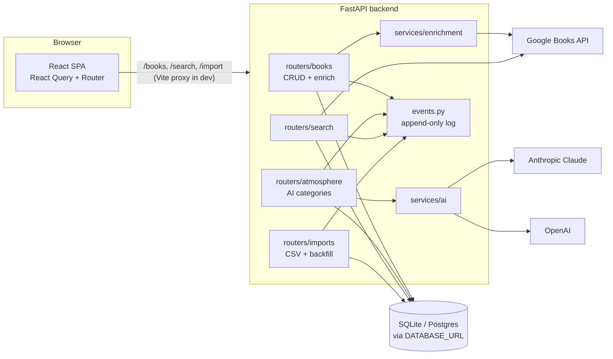
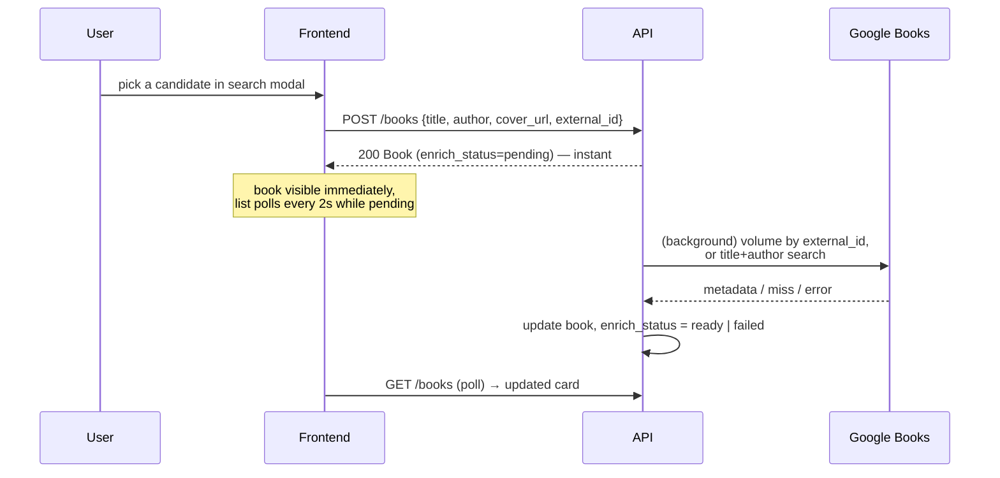

# Architecture

## Components



- **Frontend** never talks to external services directly; all traffic goes through the API.
- **React Query** owns all server state: cache keys are centralized in `src/queryKeys.js`,
  mutations invalidate by key prefix. No manual `fetch`/`useState` for server data.
- **Schema is owned by Alembic** (`alembic upgrade head`); `create_all` exists only in tests.
- **Event log** (`event` table) records every meaningful action; nothing reads it yet —
  it is the foundation for future statistics.

## Key flows

### Adding a book (background enrichment)



### AI atmosphere (unified for all categories)

```mermaid
sequenceDiagram
    participant F as Frontend
    participant B as routers/atmosphere
    participant AI as services/ai (Claude / OpenAI)

    F->>B: POST /books/{id}/atmosphere/{category}
    B->>AI: generator from CATEGORIES[category]
    AI-->>B: {source: PydanticModel} (structured outputs)
    B->>B: replace old AISelection rows<br/>(delete → flush → insert; unique constraint as safety net)
    B-->>F: {selections: [{source, payload, explanation}]}
    Note over F: same shape as GET —<br/>response goes straight into the query cache
```

Adding a category (stage 7: food, aroma) = a generator in `services/ai.py` + one entry in
`CATEGORIES` (backend) + one entry in `COPY`/`renderPayload` in `AtmosphereSection.jsx`.

## Decisions worth knowing (short ADR log)

| Decision | Why | Revisit when |
|----------|-----|--------------|
| SQLite + WAL now, `DATABASE_URL` for Postgres | zero-ops local dev; WAL lets background writer coexist with UI reads | deploying multi-user |
| Structured outputs (Pydantic → provider schema) | eliminates JSON-parsing failures; validators reject unsafe colors/fonts at the boundary | — |
| Background enrichment via `BackgroundTasks` + status field | instant UX; pattern reused for future async AI generation | task queue needed (many users) |
| AI palette applied only if WCAG contrast ≥ 4.5:1 | AI colors go into inline styles; unreadable/unsafe values fall back to base theme | — |
| Two AI providers for the same category | learning goal: compare models side by side | cost optimization |
| `raw_metadata` stored but never returned by API | keeps a full copy for future re-parsing without leaking internals | — |
