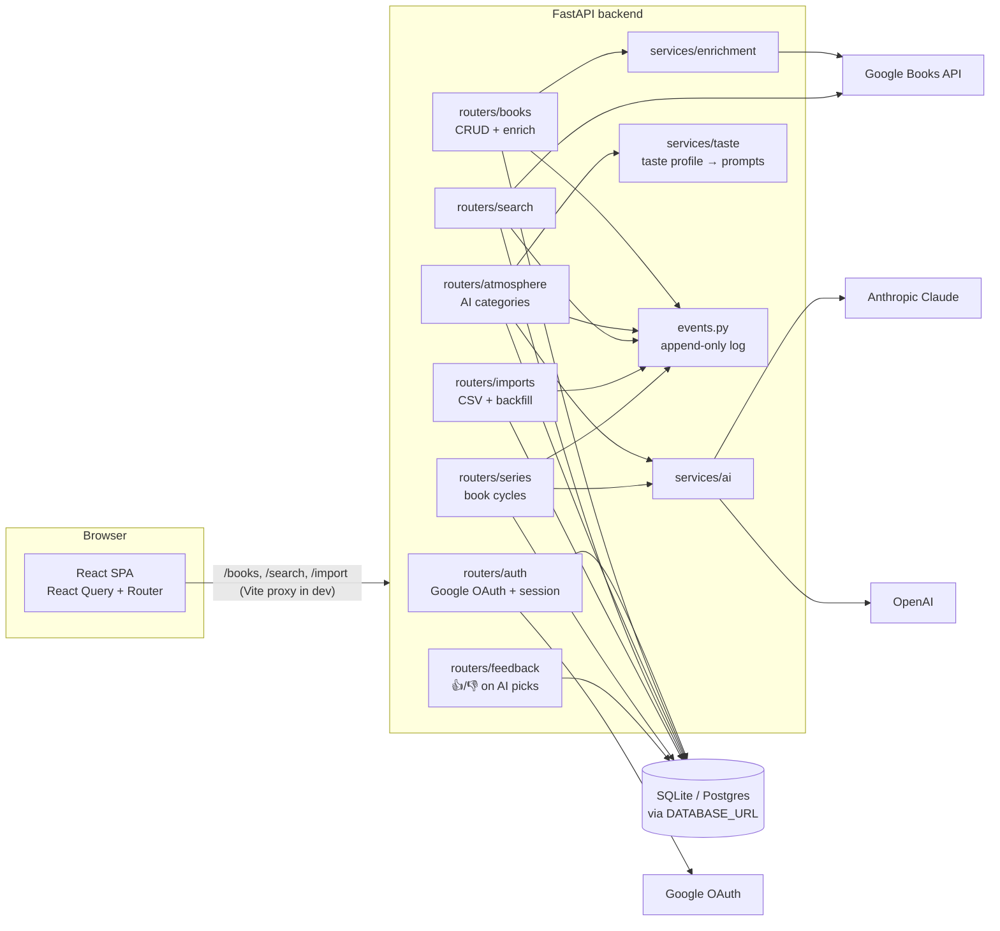
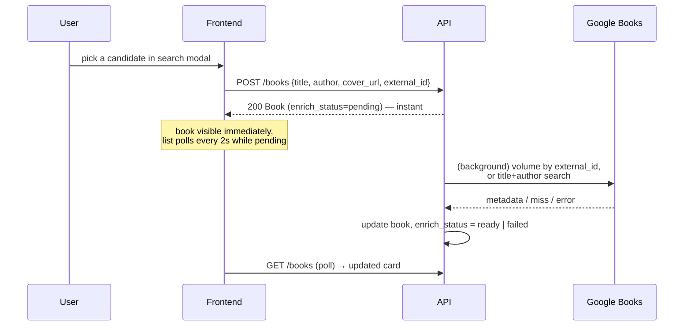

# Architecture

## Components

```mermaid
flowchart LR
    subgraph Browser
        UI[React SPA<br/>React Query + Router]
    end
    subgraph Backend [FastAPI backend]
        R0[routers/auth<br/>Google OAuth + session]
        R1[routers/books<br/>CRUD + enrich]
        R2[routers/atmosphere<br/>AI categories]
        R3[routers/search]
        R4[routers/imports<br/>CSV + backfill]
        R5[routers/series<br/>book cycles]
        R6[routers/feedback<br/>👍/👎 on AI picks]
        S1[services/enrichment]
        S2[services/ai]
        S3[services/taste<br/>taste profile → prompts]
        EV[events.py<br/>append-only log]
    end
    DB[(SQLite / Postgres<br/>via DATABASE_URL)]
    GB[Google Books API]
    AI1[Anthropic Claude]
    AI2[OpenAI]
    GO[Google OAuth]

    UI -->|"/books, /search, /import (Vite proxy in dev)"| Backend
    R0 --> GO
    R0 --> DB
    R1 --> S1
    R2 --> S2
    R2 --> S3
    R5 --> S2
    S1 --> GB
    R3 --> GB
    S2 --> AI1
    S2 --> AI2
    R1 & R2 & R3 & R4 & R5 & R6 --> DB
    R1 & R2 & R3 & R4 & R5 --> EV
```

- **Authentication** (stage 9): users sign in with Google; no passwords are stored. The
  session is a signed JWT in an httpOnly cookie, and the caller's id comes from it via
  `deps.current_user`. Every API router except `auth` is mounted with that dependency, so
  a new endpoint is protected by default. Registration is invite-only (`invite` table) —
  each account costs paid AI calls. Admin rights (`is_admin`) gate writes to *shared* data
  (book fields, atmosphere, series); anything personal — shelf, ratings, recommendations,
  stats insights — is available to every signed-in user.
- **Frontend** never talks to external services directly; all traffic goes through the API.
- **React Query** owns all server state: cache keys are centralized in `src/queryKeys.js`,
  mutations invalidate by key prefix. No manual `fetch`/`useState` for server data.
- **Schema is owned by Alembic** (`alembic upgrade head`); `create_all` exists only in tests.
- **Public showcase** (`routers/public.py`) is the only router besides `auth` served
  without a session: paper cards carry a QR to `/u/{slug}`. Its responses are assembled
  by hand rather than reused from `BookRead`, so a field added to the shared schema
  cannot leak ratings, statuses or reading dates to a stranger. Visits are recorded in
  the event log (`showcase_viewed`, `showcase_book_viewed`) — the printed cards are the
  only acquisition channel and gave no feedback at all before that. We log the **API
  call**, not the HTML: crawlers and messenger previews fetch the shell, a real browser
  fetches the data. Nothing personal is stored — no IP, no User-Agent.
- **Event log** (`event` table) records every meaningful action. `detail` is stored as
  JSON (not a string), and AI events carry per-call metrics: provider, latency and token
  usage — so "what does a generation cost and which provider is faster" is answerable.
- **Observability**: JSON logs with a request id (also returned as `X-Request-ID`),
  a fail-fast check for required API keys at startup, rate limits on the expensive
  endpoints, and security headers — see `logging_setup.py`, `rate_limit.py`, `main.py`.

## Key flows

### Adding a book (background enrichment)

```mermaid
sequenceDiagram
    participant U as User
    participant F as Frontend
    participant B as API
    participant G as Google Books

    U->>F: pick a candidate in search modal
    F->>B: POST /books {title, author, cover_url, external_id}
    B-->>F: 200 Book (enrich_status=pending) — instant
    Note over F: book visible immediately,<br/>list polls every 2s while pending
    B->>G: (background) volume by external_id,<br/>or title+author search
    G-->>B: metadata / miss / error
    B->>B: update book, enrich_status = ready | failed
    F->>B: GET /books (poll) → updated card
```

### AI atmosphere (unified for all categories)

```mermaid
sequenceDiagram
    participant F as Frontend
    participant B as routers/atmosphere
    participant AI as services/ai (Claude / OpenAI)

    F->>B: POST /books/{id}/atmosphere/{category}
    B->>AI: generator from CATEGORIES[category]
    AI-->>B: {source: PydanticModel} (structured outputs)
    B->>B: optional postprocess (music: resolve tracks in Spotify)
    B->>B: replace old AISelection rows<br/>(delete → flush → insert; unique constraint as safety net)
    B-->>F: {selections: [{source, payload, explanation}]}
    Note over F: same shape as GET —<br/>response goes straight into the query cache
```

Adding a category (stage 7: food, aroma) = a generator in `services/ai.py` + one entry in
`CATEGORIES` (backend) + one entry in `COPY`/`renderPayload` in `AtmosphereSection.jsx`.
A category may also register a `postprocess` hook — see music and aroma below.

**Music has an extra step.** Models routinely invent plausible track titles (Ólafur
Arnalds has no "Familiar Ground"), and such a track would end up on the book page and on
the printed card. So `CATEGORIES["music"]["postprocess"]` resolves every unique track in
Spotify — in one parallel pass that returns both canonical names (saved with the
atmosphere) and track URIs (used to create or refresh the book's playlist right away).
Tracks that don't resolve are dropped. Without Spotify credentials the step degrades to
"save as generated" — an unverified atmosphere beats an empty one.

**Aroma has an extra step too, for a different reason.** An aroma item is not free text:
it names a raw material you can buy (`material`) and the form it is sold in (`form`),
and only then the evocative name (`title`). The field order is the mechanism — with
structured outputs the order of fields is the order of generation, so the model must name
the substance before it invents an image. There is no external catalogue to verify
against here (unlike tracks in Spotify): catalogues of perfumery *notes* exist, but a note
in a reference is not a product on a shelf.

`CATEGORIES["aroma"]["postprocess"]` drops items naming controlled substances, household
chemicals and fuels, or poisonous plants. This is a boundary, so it lives in code
(`services/aroma_safety.py`); the prompt states the criterion in one sentence and never
lists the blocked names — naming things to avoid primes the model into producing them.
Dropped names are written to the `ai_aroma_generated` event (`dropped_unsafe`) so the two
indistinguishable cases — "the model keeps reaching for banned material" and "the filter
cuts legitimate material" — can be told apart from data rather than from the screen.

⚠ Items generated before 2026-08-12 have no `material`/`form`; readers must tolerate their
absence rather than assume the newer shape.

## Runtime states and failure behaviour

Book states (shelf status, enrichment, passport, atmosphere, playlist) are independent
dimensions, and every external dependency is optional. Both are documented separately:
see [states-and-degradation.md](states-and-degradation.md).

The API contract is snapshotted in [openapi.json](openapi.json) — regenerate with
`python scripts/dump_openapi.py` (from `backend/`) after changing endpoints, so breaking changes show up
as a plain diff.

## Decisions worth knowing (short ADR log)

| Decision | Why | Revisit when |
|----------|-----|--------------|
| SQLite + WAL now, `DATABASE_URL` for Postgres | zero-ops local dev; WAL lets background writer coexist with UI reads | deploying multi-user |
| Structured outputs (Pydantic → provider schema) | eliminates JSON-parsing failures; validators reject unsafe colors/fonts at the boundary | — |
| Background enrichment via `BackgroundTasks` + status field | instant UX; pattern reused for future async AI generation | task queue needed (many users) |
| AI palette applied only if WCAG contrast ≥ 4.5:1 | AI colors go into inline styles; unreadable/unsafe values fall back to base theme | — |
| Two AI providers for the same category | learning goal: compare models side by side | cost optimization |
| `raw_metadata` stored but never returned by API | keeps a full copy for future re-parsing without leaking internals | — |
| Tracks resolved against Spotify **before** the atmosphere is saved | models invent titles; verifying at export time left them visible in the app and on printed cards | another catalog is added as a source |
| One resolve pass feeds both the atmosphere and the playlist | halves Spotify calls; the playlist is ready the moment the atmosphere is | playlists become per-user (stage 9) |
| Playlist refresh replaces items instead of recreating | the URL is printed as a QR code on cards — it must stay valid | — |
| Cooldown breaker instead of honouring a long Spotify `Retry-After` | a 429 with a ~21 h wait once froze the single worker; waiting is pointless, so we skip Spotify until the ban lifts and keep serving | — |
| A process-wide semaphore (4 parallel searches) instead of a job queue | the quota is counted **per application**, and each resolve pass spawns 6 threads — two concurrent generations already make 12 calls. One machine with one uvicorn worker means every call lives in one process, so a semaphore is enough; a persistent queue would be complexity for its own sake | several workers or machines (then an external coordinator is required) |
| One service Spotify account for the whole service | since Feb 2026 a Development-Mode app allows only 5 authorized users, and extended quota is granted to organizations only — per-user OAuth is simply not available to us | the project becomes an organization |
| Tile colour for a book symbol chosen by contrast with the **symbol's own ink**, not by the interface theme | the model draws one symbol for two palettes and its colour is not pinned; one book's cross was drawn in exactly the palette's background colour and vanished | symbols are generated per palette |
| AI accent colour is nudged to AA instead of rejected | the contrast check covered only text/background, while the accent is used both as text and as a button fill; discarding the whole palette over one colour loses the book's look, so lightness is shifted until it passes | — |
| Waitlist e-mails go to Formspree, not to our own endpoint | storing other people's addresses means a table, exports, deletion on request and responsibility for personal data — for one input field | a mailing list becomes a product feature |
| Structured JSON logs + request id (`X-Request-ID`) | needed before publishing: filterable logs, one id ties a complaint to log lines | log shipping is set up |
| In-memory rate limiter instead of slowapi/Redis | one instance in production; a plain counter is enough and adds no dependency | scaling beyond one instance |
| ~~Basic Auth (shared password) for the test deploy~~ — replaced by Google sign-in on 2026-07-26 | it closed the service and the AI budget until real auth landed; the middleware stays in the code, the env vars are unset | — |
| Sign in with Google instead of our own passwords | no password hashes, resets or leaks to own; the account id (`sub`) is all we need | a provider-independent login is required |
| Session as a signed JWT in an httpOnly cookie | scripts on the page cannot read it (XSS), `SameSite=Lax` survives the return trip from Google | tokens must be shared with other clients |
| Google's `id_token` signature is not re-verified | it arrives over HTTPS in the response to our own `client_secret` call — a trusted channel (Google permits this for the authorization-code flow); `aud` and `email_verified` are still checked | the implicit flow is ever used |
| Auth enforced per **router**, not per endpoint | a new endpoint is protected by default; forgetting the dependency cannot silently expose data | — |
| Registration is invite-only | every account spends paid AI calls; open sign-up is other people's spending | a self-serve paid tier exists |
| Personal AI (recommendations, stats insights) is not admin-gated | those are computed from one's own shelf; gating them would answer 403 to every tester. Spend is capped by rate limits and provider budgets | per-user quotas are needed |
| Series split into shared `series` + personal `userseries` | repeats the book/userbook split: a cycle exists objectively, the reading status does not | — |
| Books outside the shelf are plain catalog rows | a cycle needs "what's next" without inventing a placeholder entity; search finds them anyway | — |
| Author is an entity, but `book.author` remains a string | the string renders the book page and the printed card; adding links *beside* it makes the migration non-destructive and the rollback free | the string starts disagreeing with the links (needs a merge UI) |
| Author strings split by an explicit exception list, not by rules | a survey of 150 strings found three glued ones and zero "Surname, Name" cases; a heuristic parser would be a silent-error generator, and "Аркадий и Борис Стругацкие" (one shared surname, plural) defeats any separator split anyway | co-authors become common in new data |
| Author page is behind sign-in | it lists the whole shelf for an author, including books outside the showcase; public, it would be a way around the showcase, which shows only selected books | — |
| Series data entered by hand, never by AI | a survey found zero series data in Google Books and OpenLibrary; models invent volume numbers confidently | a reliable source appears |
| Feedback stored locally and injected into prompts | model APIs are stateless and cannot be taught our 👍/👎; the "taste memory" has to live on our side | profile outgrows a prompt (→ embeddings) |
| An unresolved track is replaced by a real recording of the same artist, not dropped | the prompt pushed the model away from the overused canon and Spotify verification pushed it straight back: famous artists always resolve, obscure ones get invented titles. Distinct artists across the library sat at ~325 through four rounds of prompt edits and reached 353 the moment substitution landed. The invented part is the *title*; the artist was chosen deliberately | a catalog with reliable track-level search is used |
| Diversity is enforced in code, not asked for in the prompt | four formulations were measured — a banned-track list, a banned-artist list, a description of the canon instead of names, and a self-check field in the schema. Each gave zero or made it worse; the self-check field was the worst, because both models rewrote the whole banned list into it and thereby primed themselves right before choosing tracks | the model reliably honours negative constraints |
| Font names come from a closed `Literal` in the schema, not from free text | the model invented `Freight Text Pro` (a commercial face, absent from Google Fonts) for 19 books; such a font fails silently — `<link>` raises nothing and the book just loses its typeface. A `Literal` reaches the tool schema, so the wrong answer becomes unrepresentable rather than merely discouraged | fonts are self-hosted |
| Interface fonts are loaded with **one `<link>` per family** | the `css2` endpoint is all-or-nothing: a single invalid family or weight returns 400 and *no* font from that request loads, silently falling back to Georgia | fonts are self-hosted |
| The accent is checked in both of its roles by one shared helper | it is text on the scene background *and* a fill under letters; the fix for the first role was written twice, in two files, and the second copy never got it | — |
| The model's reasoning is persisted (`aiselection.analysis`) | reasoning-as-schema was in use while its output was thrown away, so "did the technique work?" was unanswerable even in hindsight | — |
| An aroma item names a buyable `material` **before** its evocative `title` | the schema was shared with food (`title` + `description`, both free text) and the prompt asked for "candles, incense, essential oils" — so the model dutifully invented product names. A measurement over 377 stored items found exactly **one** that looked like an ordinary raw material. Field order is the fix: with structured outputs the order of fields is the order of generation | a retail catalogue becomes available to verify against |
| Aroma raw materials are **not** restricted to a closed list | a `Literal` would make invention impossible, but the point of the feature is to introduce the reader to unfamiliar scents, and a fixed list freezes the world at what we know today. Only `form` is closed — there are about a dozen forms and no new ones are coming | — |
| Unsafe materials are filtered in code; the blocked list never reaches the prompt | making the model's answer *actionable* made harmful answers actionable too — the first regeneration suggested cannabis for a book about smuggling. Naming things to avoid primes the model into producing them (measured on banned artists), so the prompt carries the criterion and the code carries the names | — |
| Repetition for aroma is keyed on `material`, not on `title` | once `title` became an evocative image it was unique by construction, so the `avoid` list silently emptied and mode collapse lost its brake: iris, frankincense and oakmoss each appeared in 10 of 22 selections. Keys fall back to `title` for pre-2026-08-12 items | — |
| Aroma `form` is chosen by availability, not by tradition | the prompt used to say "pick the form this material is usually sold in", which pushed the model toward raw forms — 15 resins against 8 candles. Scented candles are the most widely stocked product and cover the widest range of notes | — |
| `resin` was dropped from the `form` enum rather than discouraged in the prompt | the availability wording moved candles 8 → 23 but left resins at 15 → 16 — a request in the prompt is a preference, not a boundary. Narrowing the `Literal` makes the unwanted answer unrepresentable, the same move that fixed invented fonts. Frankincense and myrrh are not lost: both are sold as incense and as essential oil | resins become easy to buy |
