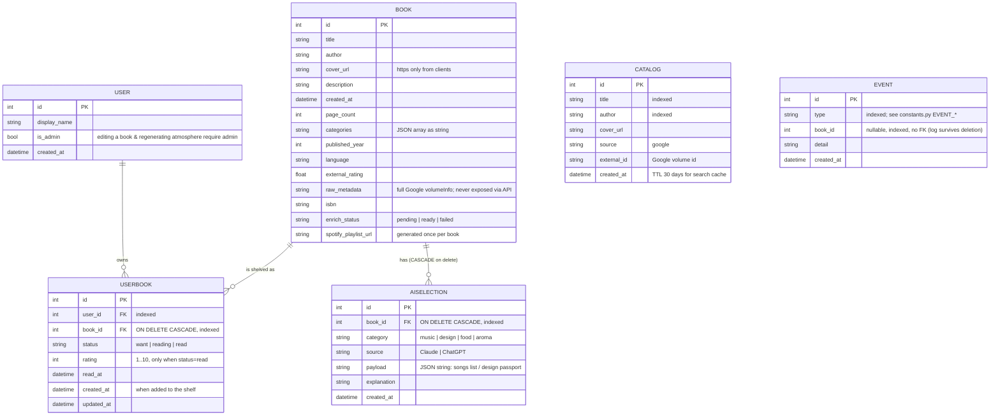

# Data model

Schema is owned by Alembic (`backend/alembic/`). Current revision: `0005_split_user_book_userbook`.

As of revision 0005 the former mixed `book` table is split into three:

- **`user`** — who reads (single user for now, `id=1`, admin).
- **`book`** — the shared catalog: intrinsic, book-level data, the same for everyone who
  adds the book. AI atmosphere (`aiselection`) and the Spotify playlist live here too —
  generated once per book and reused by every shelf that references it.
- **`userbook`** — a personal shelf entry: how a given user holds a given book (status,
  rating, read date).



The API response (`BookRead`) stays flat: `routers/books.py:_to_book_read` joins a `book`
row with the caller's `userbook` row, so the frontend reads the same field names as before.

## Adding, reuse and deletion

- **Search order when adding:** local `book` catalog first (case-insensitive, Python-side —
  SQLite `lower()` does not fold Cyrillic), then Google Books (cached in `catalog`), then
  manual entry.
- **Reuse:** adding a book that already exists in the catalog (matched by `book_id` from
  local search, or by normalized title+author) creates only a `userbook` row and reuses the
  existing atmosphere/playlist — no regeneration, no token spend.
- **Duplicate on a shelf** → HTTP 409 (`UNIQUE(user_id, book_id)`).
- **Deletion** removes the `userbook` row; if no shelf references the book any more, the
  `book` row is deleted and its `aiselection` rows cascade.

## Invariants

Enforced in code and/or schema:

1. **Rating only for `read`** — PATCH rejects it otherwise; leaving `read` clears the rating.
   Also a DB CHECK `ck_userbook_rating_only_read` on `userbook` (moved there from `book`
   in revision 0005).
2. **One book per shelf** — DB unique constraint `uq_userbook_user_book`.
3. **One selection per (book, category, source)** — unique constraint
   `uq_aiselection_book_category_source`; regeneration replaces rows (delete → flush → insert).
4. **Deleting a book cascades to its AISelection rows** — FK `ON DELETE CASCADE`
   (requires `PRAGMA foreign_keys=ON`, set per-connection in database.py). NB: the same
   pragma must be **off** during migrations that recreate `book` — see
   `docs/План_рефакторинг_User_Book.md` and `alembic/env.py`.
5. **Admin-only writes to shared data** — editing a book's shared fields (title, author,
   ISBN, cover, description) and (re)generating atmosphere require `user.is_admin`.
6. **Events are append-only** — never updated or deleted; `book_id` has no FK so history
   survives book deletion.
7. **`cover_url` from clients must be `https://`** (schemas.py); AI palette colors must be
   hex, font names alphanumeric (services/ai.py validators).

## Status lifecycles

`Book.enrich_status` (book-level):

```
pending ──(background fetch ok / miss)──► ready
   │                                        ▲
   └──(exception in background)──► failed ──┘ (manual "Refresh info", admin)
```

- New books via API start at `pending`; CSV-imported and legacy books are `ready`.
- Frontend polls the list every 2 s while any book is `pending`.

`UserBook.status` (per-user): `want ↔ reading ↔ read`, any transition allowed;
`rating` and `read_at` survive only inside `read`.
