# Data model

Schema is owned by Alembic (`backend/alembic/`). Current revision: `0012_series`.

**The core split (revision 0005)** — the former mixed `book` table became three:

- **`user`** — who reads (single user for now, `id=1`, admin).
- **`book`** — the shared catalog: intrinsic, book-level data, the same for everyone who
  adds the book. AI atmosphere (`aiselection`) and the Spotify playlist live here too —
  generated once per book and reused by every shelf that references it.
- **`userbook`** — a personal shelf entry: how a given user holds a given book (status,
  rating, read date).

**The same principle repeats for series (revision 0012):** `series` is shared (a cycle
exists objectively), `userseries` holds the personal reading status. A book's membership
in a cycle (`book.series_id`, `series_index`) is an intrinsic property of the book.

**A book with no `userbook` row is normal** — it lives in the catalog without being on
anyone's shelf. That is how a cycle shows books you don't own yet ("what to read next"),
and such books are still found by search.

```mermaid
erDiagram
    USER ||--o{ USERBOOK : "owns"
    USER ||--o{ USERSERIES : "tracks"
    USER ||--o{ FEEDBACK : "rates"
    USER ||--o{ RECOMMENDATION : "gets"
    BOOK ||--o{ USERBOOK : "is shelved as"
    BOOK ||--o{ AISELECTION : "has (CASCADE on delete)"
    SERIES ||--o{ BOOK : "groups (SET NULL on delete)"
    SERIES ||--o{ USERSERIES : "is tracked as"
    USER {
        int id PK
        string display_name
        bool is_admin "editing a book & regenerating atmosphere require admin"
        datetime created_at
    }
    BOOK {
        int id PK
        string title
        string author
        string cover_url "https only from clients"
        string description
        datetime created_at
        int page_count
        string categories "JSON array as string"
        int published_year
        string language
        float external_rating
        string raw_metadata "full Google volumeInfo; never exposed via API"
        string isbn
        string enrich_status "pending | ready | failed"
        string spotify_playlist_url "generated once per book"
        int series_id FK "nullable — cycle membership (task 89)"
        int series_index "position in the cycle"
    }
    SERIES {
        int id PK
        string name "indexed"
        string author
        string description "written by the reader; feeds the ex-libris prompt"
        string design "JSON design passport: palettes, fonts, symbol_svg"
        datetime created_at
    }
    USERSERIES {
        int id PK
        int user_id FK "indexed"
        int series_id FK "ON DELETE CASCADE, indexed"
        string status "reading | read | dropped"
        datetime created_at
        datetime updated_at
    }
    USERBOOK {
        int id PK
        int user_id FK "indexed"
        int book_id FK "ON DELETE CASCADE, indexed"
        string status "want | reading | read"
        int rating "1..10, only when status=read"
        datetime read_at
        datetime created_at "when added to the shelf"
        datetime updated_at
    }
    AISELECTION {
        int id PK
        int book_id FK "ON DELETE CASCADE, indexed"
        string category "music | design | food | aroma"
        string source "Claude | ChatGPT"
        string payload "JSON string: songs list / design passport"
        string explanation
        bool verified "music only: false = saved during a Spotify ban (task 85)"
        datetime created_at
    }
    RECOMMENDATION {
        int id PK
        int user_id FK "indexed"
        string title
        string author
        string reason "why this book suits this reader"
        string source "Claude | ChatGPT — both models advise (5 each)"
        string cover_url
        string external_id
        datetime created_at
    }
    FEEDBACK {
        int id PK
        int user_id FK "indexed"
        string ref "target key: atmosphere:{book}:{cat}:{source} | recommendation:{title}|{author}"
        string source "Claude | ChatGPT — for acceptance rate"
        string verdict "up | down"
        datetime created_at
    }
    TRACKCACHE {
        int id PK
        string query_key "unique: normalized 'artist|title' as asked by the model"
        bool found "negative results cached too — inventions must not re-hit Spotify"
        string title "canonical, when found"
        string artist "canonical"
        string uri "Spotify track uri"
        datetime created_at
    }
    CATALOG {
        int id PK
        string title "indexed"
        string author "indexed"
        string cover_url
        string source "google"
        string external_id "Google volume id"
        datetime created_at "TTL 30 days for search cache"
    }
    EVENT {
        int id PK
        string type "indexed; see constants.py EVENT_*"
        int book_id "nullable, indexed, no FK (log survives deletion)"
        json detail "structured (task 80); AI events carry ai_calls: provider, latency, tokens"
        datetime created_at
    }
```



The API response (`BookRead`) stays flat: `routers/books.py:_to_book_read` joins a `book`
row with the caller's `userbook` row, so the frontend reads the same field names as before.

## Adding, reuse and deletion

- **Search order when adding:** local `book` catalog first (case-insensitive, Python-side —
  SQLite `lower()` does not fold Cyrillic), then Google Books (cached in `catalog`), then
  manual entry.
- **Reuse:** adding a book that already exists in the catalog (matched by `book_id` from
  local search, or by normalized title+author) creates only a `userbook` row and reuses the
  existing atmosphere/playlist — no regeneration, no token spend.
- **Duplicate on a shelf** → HTTP 409 (`UNIQUE(user_id, book_id)`).
- **Deletion** removes the `userbook` row; if no shelf references the book any more, the
  `book` row is deleted and its `aiselection` rows cascade.

## Series (book cycles)

A cycle groups books that share a world — the reader sees where they stopped and what
comes next.

- **Where the data comes from:** manual entry. A survey of the live library (201 books,
  `scripts/explore_series.py`) found **zero** series data: Google Books returned no
  `seriesInfo` for any of the 157 enriched books, OpenLibrary returned none either — not
  even for Western editions. Volume numbers appear in a title/subtitle for ~5 books, and
  the cycle name never appears at all. AI is deliberately *not* used to fill this in:
  models confidently invent series composition and volume numbers.
- **Books not on the shelf** are plain `book` rows without `userbook`. Adding one from the
  series page reuses the normal search (catalog → Google Books → manual); a book picked
  from Google is created in the catalog with its cover and queued for background
  enrichment, but is **not** put on the shelf.
- **Progress** is computed on the fly: `read` counts books whose `userbook.status = read`,
  `total` counts every book in the cycle (including ones the reader doesn't own), and
  `next_book` is the first unread by `series_index`.
- **Deleting a cycle** keeps the books: `series_id`/`series_index` are cleared.

## Invariants

Enforced in code and/or schema:

1. **Rating only for `read`** — PATCH rejects it otherwise; leaving `read` clears the rating.
   Also a DB CHECK `ck_userbook_rating_only_read` on `userbook` (moved there from `book`
   in revision 0005).
2. **One book per shelf** — DB unique constraint `uq_userbook_user_book`.
3. **One selection per (book, category, source)** — unique constraint
   `uq_aiselection_book_category_source`; regeneration replaces rows (delete → flush → insert).
4. **Deleting a book cascades to its AISelection rows** — FK `ON DELETE CASCADE`
   (requires `PRAGMA foreign_keys=ON`, set per-connection in database.py). NB: the same
   pragma must be **off** during migrations that recreate `book` — see
   `docs/План_рефакторинг_User_Book.md` and `alembic/env.py`.
5. **Admin-only writes to shared data** — editing a book's shared fields (title, author,
   ISBN, cover, description) and (re)generating atmosphere require `user.is_admin`.
   The same rule applies to series: creating, renaming, describing, generating the
   ex-libris, changing the book list and deleting a cycle are admin-only, while the
   **reading status** (`userseries.status`) is a personal action available to everyone.
6. **Events are append-only** — never updated or deleted; `book_id` has no FK so history
   survives book deletion. `detail` is JSON (revision 0007), so it can be queried.
7. **`cover_url` from clients must be `https://`** (schemas.py); AI palette colors must be
   hex, font names alphanumeric (services/ai.py validators).
8. **One feedback per (user, target)** — unique `uq_feedback_user_ref`; repeating the same
   verdict removes the row (toggle off).
9. **One cycle per (user, series)** — unique `uq_userseries_user_series`.
10. **Music is saved only after Spotify resolution** — tracks that don't resolve are
    dropped, the rest get canonical names. If Spotify is unavailable the selection is
    stored with `aiselection.verified = false` and `scripts/reverify_music.py` re-checks
    it later.

## Status lifecycles

`Book.enrich_status` (book-level):

```
pending ──(background fetch ok / miss)──► ready
   │                                        ▲
   └──(exception in background)──► failed ──┘ (manual "Refresh info", admin)
```

- New books via API start at `pending`; CSV-imported and legacy books are `ready`.
- Frontend polls the list every 2 s while any book is `pending`.

`UserBook.status` (per-user): `want ↔ reading ↔ read`, any transition allowed;
`rating` and `read_at` survive only inside `read`.

`UserSeries.status` (per-user): `reading ↔ read ↔ dropped`, any transition allowed.
Shelf order is fixed by `SERIES_STATUS_ORDER`: reading → read → dropped.
