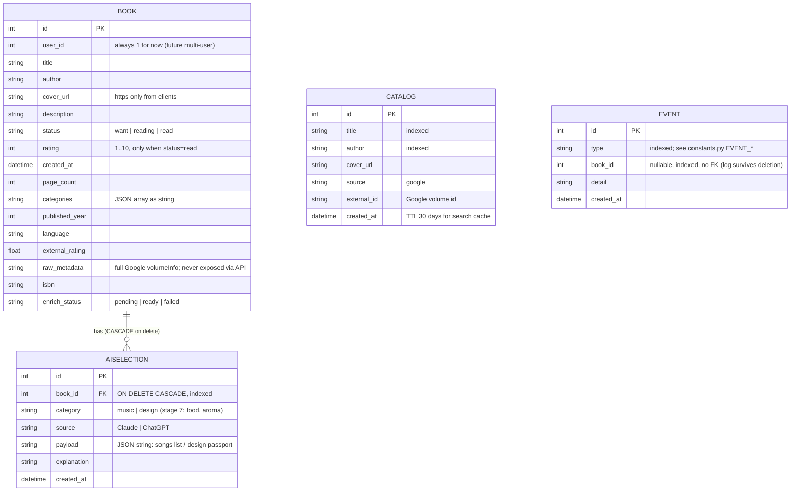

# Data model

Schema is owned by Alembic (`backend/alembic/`). Current revision: `0001_initial_schema`.



## Invariants

Enforced in code and/or schema:

1. **Rating only for `read`** — PATCH rejects rating otherwise; leaving `read` clears the
   rating (routers/books.py). Not yet a DB CHECK (backlog #7).
2. **One selection per (book, category, source)** — DB unique constraint
   `uq_aiselection_book_category_source`; regeneration replaces rows
   (delete → flush → insert).
3. **Deleting a book cascades to its AISelection rows** — FK `ON DELETE CASCADE`
   (requires `PRAGMA foreign_keys=ON`, set per-connection in database.py).
4. **Events are append-only** — never updated or deleted; `book_id` has no FK so history
   survives book deletion.
5. **`cover_url` from clients must be `https://`** (schemas.py); AI palette colors must be
   hex, font names alphanumeric (services/ai.py validators).

## Status lifecycles

`Book.enrich_status`:

```
pending ──(background fetch ok / miss)──► ready
   │                                        ▲
   └──(exception in background)──► failed ──┘ (manual "Refresh info")
```

- New books via API start at `pending`; CSV-imported and legacy books are `ready`.
- Frontend polls the list every 2 s while any book is `pending`.

`Book.status` (user-controlled): `want ↔ reading ↔ read`, any transition allowed;
`rating` survives only inside `read`.
