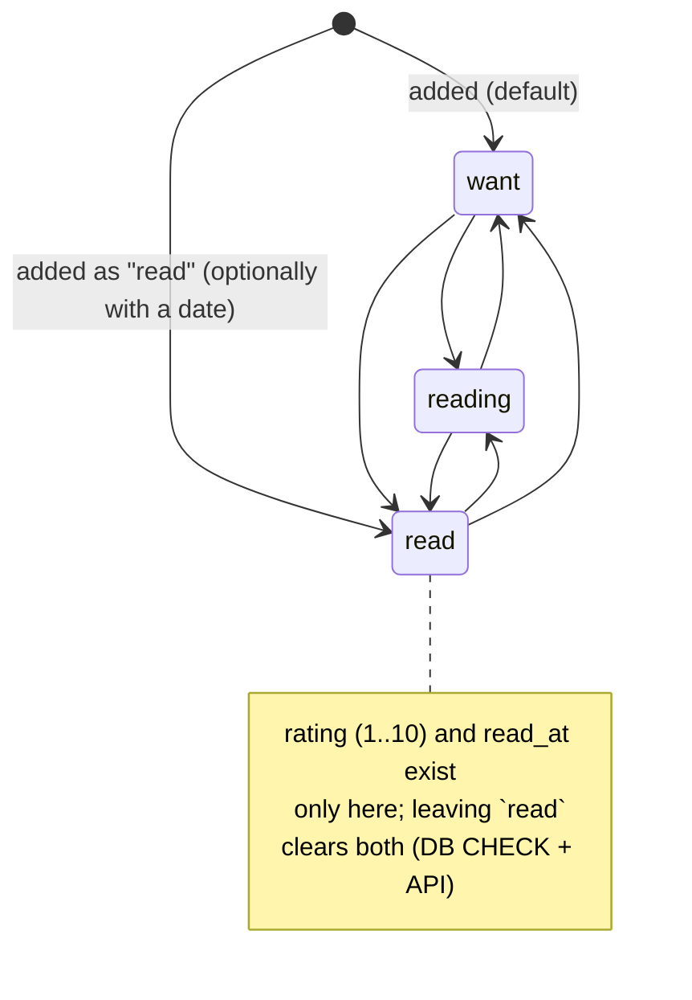
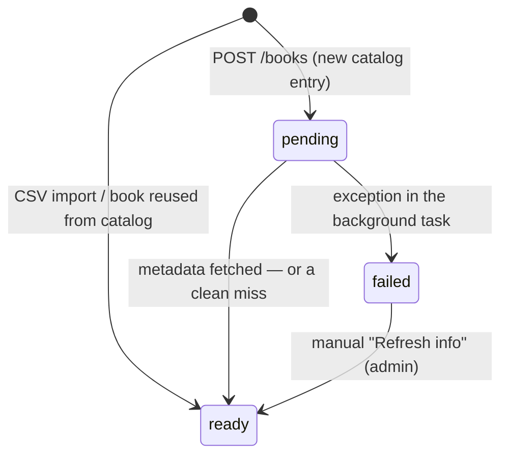
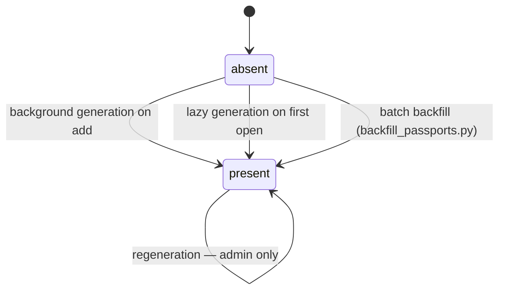
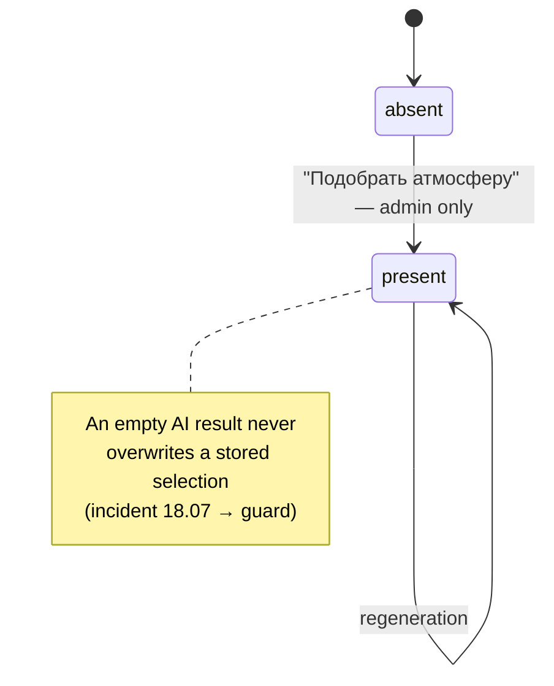
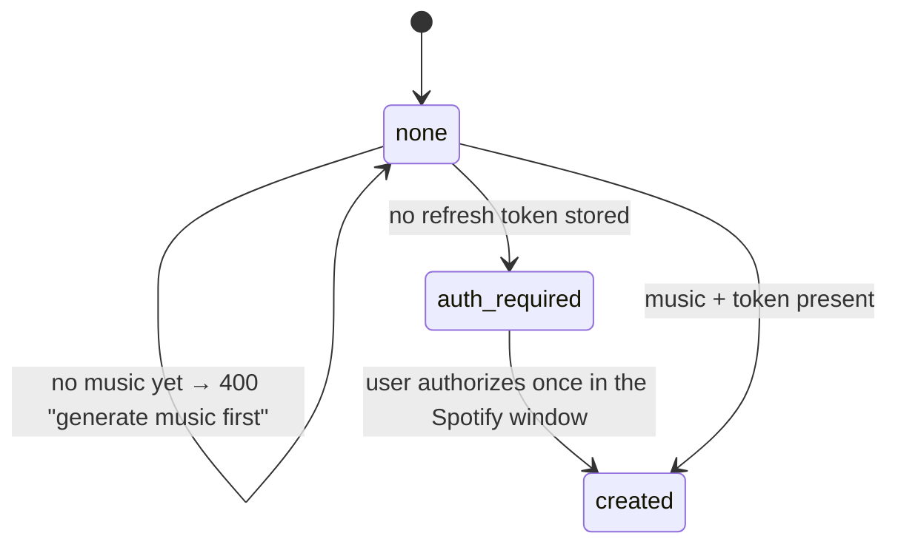

# Book states and graceful degradation

Two things this document answers:

1. **What states a book can be in** — the dimensions are independent, which is why a
   single flat diagram would be misleading.
2. **What the user sees when an external system fails** — every dependency is optional;
   the library itself keeps working.

---

## 1. Book states

A book is described by five *independent* dimensions. A book can be `read` with a failed
enrichment and a ready passport but no atmosphere — all combinations are legal.

| Dimension | Stored in | Values |
|---|---|---|
| Shelf status | `userbook.status` | `want` / `reading` / `read` |
| Metadata enrichment | `book.enrich_status` | `pending` / `ready` / `failed` |
| Design passport | `aiselection` (category `design`) | absent / present |
| Atmosphere | `aiselection` (`music`, `food`, `aroma`) | absent / present, per category |
| Spotify playlist | `book.spotify_playlist_url` | absent / present |

### Shelf status (personal, per user)

### Metadata enrichment (shared, per book)

The frontend polls `GET /books` every 2 s while any book is `pending`.

### Design passport (shared, per book)

### Atmosphere, per category (shared, per book)

### Spotify playlist (shared, per book)

### What the user sees

| Book state | Shelf (covers mode) | Shelf (symbols mode) | Book page |
|---|---|---|---|
| enrichment `pending` | placeholder, "loading" hint | passport symbol or moon | "Cover and description are loading…" |
| enrichment `failed` | "No cover" | passport symbol or moon | error + "Refresh info" |
| no passport | cover or "No cover" | **moon logo** (brand fallback) | no exlibris, base theme |
| passport present | cover | exlibris on the passport palette | page repainted in the book's palette |
| no atmosphere | — | — | "Nothing yet. Press «Подобрать атмосферу»" |
| broken `symbol_svg` | — | moon (via `onError`) | symbol hidden, "No cover" |

---

## 2. Graceful degradation

Principle: **a failing dependency degrades a feature, never the library.** Books, statuses
and ratings live in the local database and are always available.

| System | Failure | Backend behaviour | What the user sees | Recovery |
|---|---|---|---|---|
| **Google Books** (enrichment) | 429 / 5xx / timeout | 3 attempts, `Retry-After` + backoff & jitter; then an empty result. Background task catches everything → `enrich_status = failed` | Book is already on the shelf with title and author; error line + "Refresh info" | Manual "Refresh info" (admin), or `POST /books/backfill-metadata` |
| **Google Books** (search) | any error | `search_books` returns `[]` | Local catalog matches still shown; if nothing — "Ничего не найдено" + **"Добавить вручную"** | Manual entry always works |
| **Anthropic Claude** (atmosphere) | error / timeout (90 s) | `safe_ask` returns an empty fallback; the guard skips writing it | The other provider's variant is still shown; if both failed — the previous selection survives untouched | Press the button again |
| **Anthropic Claude** (passport) | error / timeout | `generate_design` raises; the background task logs and gives up (book stays without a passport) | Shelf shows the moon logo; page uses the base theme | Reopen the book (lazy retry) or run `backfill_passports.py` |
| **OpenAI** (atmosphere) | error / refusal / truncation | same `safe_ask` fallback | Only the Claude variant in the source tabs | Regenerate |
| **Spotify** | no refresh token | `POST /playlist` → `{status: "auth_required", auth_url}` | Authorisation window opens; playlist is created right after | One-time authorisation |
| **Spotify** | no music generated | `400` with a localized message | "Generate music first — the playlist is built from it"; the button is disabled until music exists | Generate atmosphere |
| **Spotify** | API error | exception → 500 | "Плейлист не создался: …" on the book page | Retry |
| **QR code** | no playlist | `404` | Dashed placeholder frame on the print card | Create the playlist |
| **Database** | unavailable | `GET /health` → 500 | Library fails to load, "Повторить" button | Restore from `backend/backups/` (see `backup_db.py`) |

### Notes

- AI clients use a **90 s timeout** (task 54) so a hanging provider cannot block the UI.
- Structured outputs (and tool schemas in the batch script) mean a malformed AI answer is
  rejected at the boundary rather than stored.
- AI palettes are applied **only** if they pass a WCAG 4.5:1 contrast check; otherwise the
  base theme is used.
- Secrets live in `backend/.env`; a missing key surfaces as a failed generation, not a crash.
