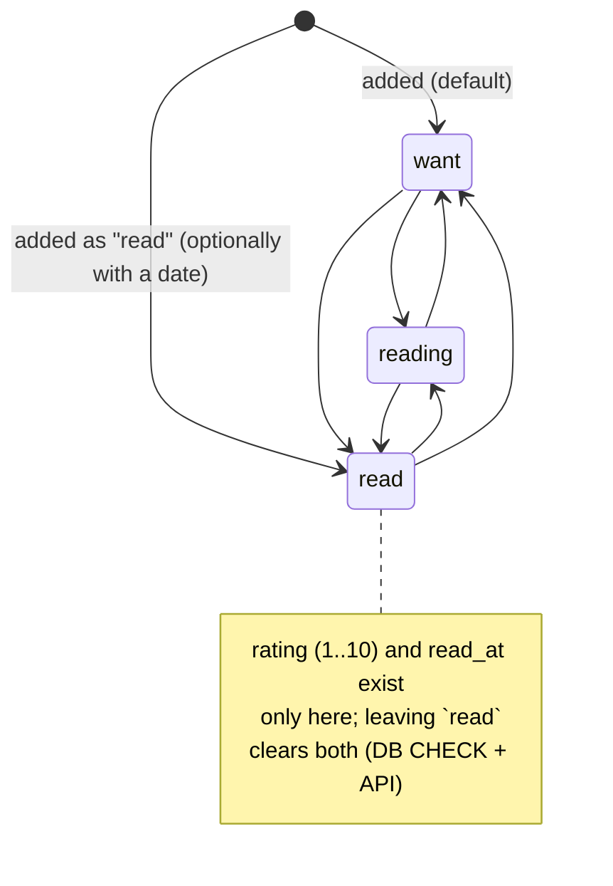
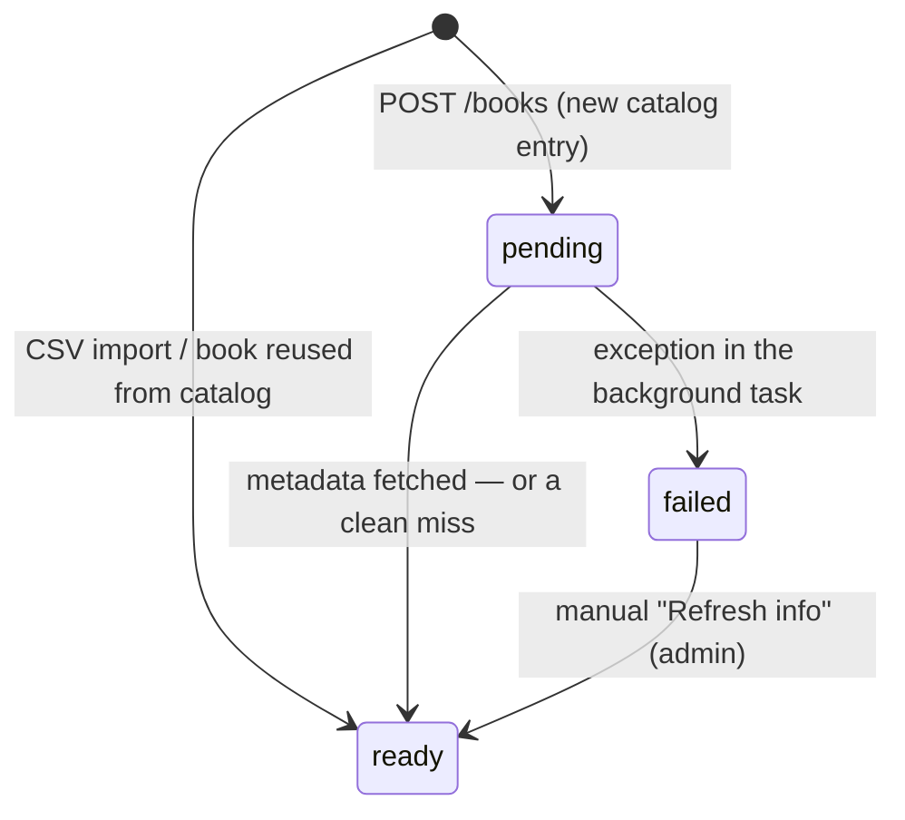
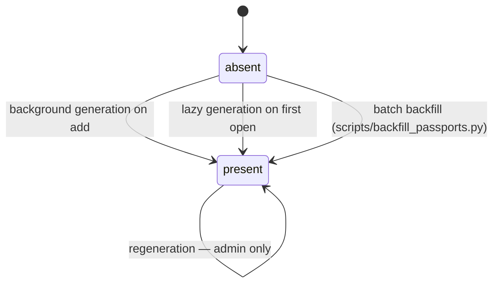
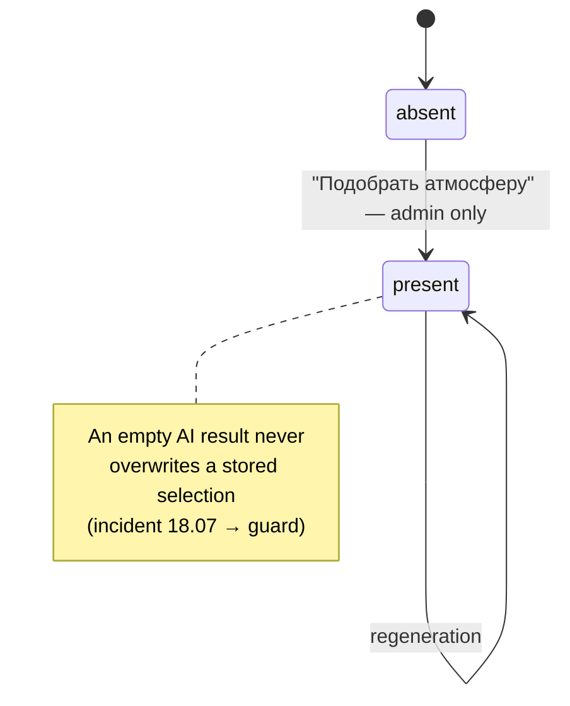
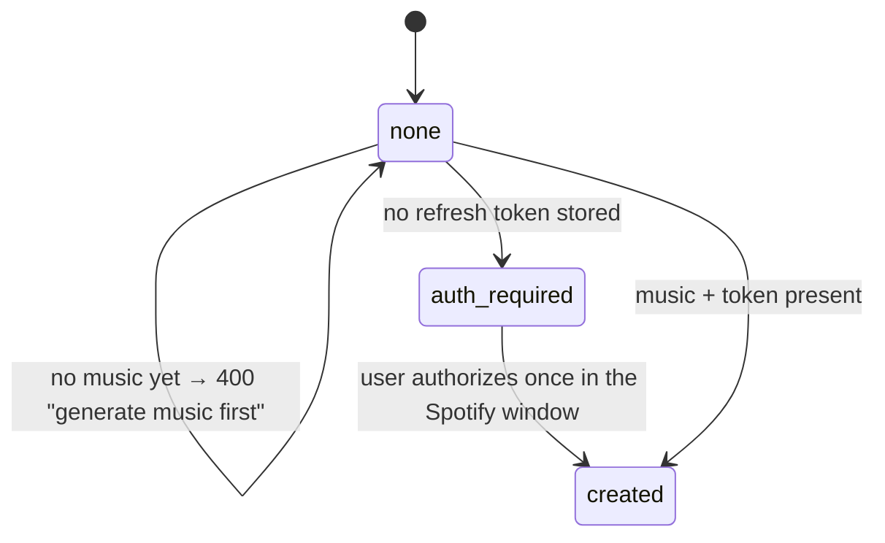

# Book states and graceful degradation

Two things this document answers:

1. **What states a book can be in** — the dimensions are independent, which is why a
   single flat diagram would be misleading.
2. **What the user sees when an external system fails** — every dependency is optional;
   the library itself keeps working.

---

## 1. Book states

A book is described by five *independent* dimensions. A book can be `read` with a failed
enrichment and a ready passport but no atmosphere — all combinations are legal.

| Dimension | Stored in | Values |
|---|---|---|
| Shelf status | `userbook.status` | `want` / `reading` / `read` |
| Metadata enrichment | `book.enrich_status` | `pending` / `ready` / `failed` |
| Design passport | `aiselection` (category `design`) | absent / present |
| Atmosphere | `aiselection` (`music`, `food`, `aroma`) | absent / present, per category |
| Spotify playlist | `book.spotify_playlist_url` | absent / present |

### Shelf status (personal, per user)

```mermaid
stateDiagram-v2
    [*] --> want: added (default)
    [*] --> read: added as "read" (optionally with a date)
    want --> reading
    want --> read
    reading --> read
    reading --> want
    read --> reading
    read --> want
    note right of read
        rating (1..10) and read_at exist
        only here; leaving `read`
        clears both (DB CHECK + API)
    end note
```

### Metadata enrichment (shared, per book)

```mermaid
stateDiagram-v2
    [*] --> pending: POST /books (new catalog entry)
    [*] --> ready: CSV import / book reused from catalog
    pending --> ready: metadata fetched — or a clean miss
    pending --> failed: exception in the background task
    failed --> ready: manual "Refresh info" (admin)
```

The frontend polls `GET /books` every 2 s while any book is `pending`.

### Design passport (shared, per book)

```mermaid
stateDiagram-v2
    [*] --> absent
    absent --> present: background generation on add
    absent --> present: lazy generation on first open
    absent --> present: batch backfill (scripts/backfill_passports.py)
    present --> present: regeneration — admin only
```

### Atmosphere, per category (shared, per book)

```mermaid
stateDiagram-v2
    [*] --> absent
    absent --> present: "Подобрать атмосферу" — admin only
    present --> present: regeneration
    note right of present
        An empty AI result never
        overwrites a stored selection
        (incident 18.07 → guard)
    end note
```

### Spotify playlist (shared, per book)

```mermaid
stateDiagram-v2
    [*] --> none
    none --> none: no music yet → 400 "generate music first"
    none --> auth_required: no refresh token stored
    auth_required --> created: user authorizes once in the Spotify window
    none --> created: music + token present
```

### What the user sees

| Book state | Shelf (covers mode) | Shelf (symbols mode) | Book page |
|---|---|---|---|
| enrichment `pending` | placeholder, "loading" hint | passport symbol or moon | "Cover and description are loading…" |
| enrichment `failed` | "No cover" | passport symbol or moon | error + "Refresh info" |
| no passport | cover or "No cover" | **moon logo** (brand fallback) | no exlibris, base theme |
| passport present | cover | exlibris on the passport palette | page repainted in the book's palette |
| no atmosphere | — | — | "Nothing yet. Press «Подобрать атмосферу»" |
| broken `symbol_svg` | — | moon (via `onError`) | symbol hidden, "No cover" |

---

## 2. Graceful degradation

Principle: **a failing dependency degrades a feature, never the library.** Books, statuses
and ratings live in the local database and are always available.

| System | Failure | Backend behaviour | What the user sees | Recovery |
|---|---|---|---|---|
| **Google Books** (enrichment) | 429 / 5xx / timeout | 3 attempts, `Retry-After` + backoff & jitter; then an empty result. Background task catches everything → `enrich_status = failed` | Book is already on the shelf with title and author; error line + "Refresh info" | Manual "Refresh info" (admin), or `POST /books/backfill-metadata` |
| **Google Books** (search) | any error | `search_books` returns `[]` | Local catalog matches still shown; if nothing — "Ничего не найдено" + **"Добавить вручную"** | Manual entry always works |
| **Anthropic Claude** (atmosphere) | error / timeout (90 s) | `safe_ask` returns an empty fallback; the guard skips writing it | The other provider's variant is still shown; if both failed — the previous selection survives untouched | Press the button again |
| **Anthropic Claude** (passport) | error / timeout | `generate_design` raises; the background task logs and gives up (book stays without a passport) | Shelf shows the moon logo; page uses the base theme | Reopen the book (lazy retry) or run `scripts/backfill_passports.py` |
| **OpenAI** (atmosphere) | error / refusal / truncation | same `safe_ask` fallback | Only the Claude variant in the source tabs | Regenerate |
| **Spotify** (track resolution) | no credentials / network error | `resolve_songs` returns the songs unchanged | Atmosphere is saved unverified (may contain invented tracks); no playlist yet | Regenerate once Spotify works, or run `scripts/verify_music.py` |
| **Spotify** (track resolution) | 429 / 5xx (short) | up to 3 attempts honouring `Retry-After` (capped at `MAX_WAIT` 5 s), then the track counts as missing | Fewer tracks in the list and the playlist | Regenerate the atmosphere |
| **Model invents a track title** | title not found for that artist | fallback chain: exact search → retry with title/artist swapped → **any real recording by the same artist** (`find_any_by_artist`). Only if all three fail is the track dropped | A real track by the artist the model chose, instead of a hole in the selection | — (automatic) |
| **Spotify** (track resolution) | 429 with long `Retry-After` (app quota ban) | **circuit breaker**: if `Retry-After` > `COOLDOWN_THRESHOLD` (30 s), the service enters a cooldown (`in_cooldown()`) and skips Spotify entirely until it passes — no waiting, no retries | Atmosphere saved unverified, no playlist; server stays responsive | Wait out the cooldown (usually an hour or two), then regenerate |
| **Spotify** (playlist on generation) | no refresh token | playlist step is skipped; the atmosphere is still saved | Fallback button "Создать плейлист в Spotify" | One-time authorisation, then press the button |
| **Spotify** (playlist on generation) | API error | logged, generation still succeeds | Fallback button as above | Retry via the button |
| **Spotify** | no music generated | the whole playlist block is hidden | Nothing — the button would be useless without music | Generate atmosphere |
| **Playlist cover** | `requirements-cover.txt` not installed / bad SVG | `build_cover` returns `None`, upload skipped | Spotify shows its default mosaic of track covers | `pip install -r requirements-cover.txt`, then `scripts/reset_playlist.py --cover` |
| **QR code** | no playlist | `404` | Dashed placeholder frame on the print card | Create the playlist |
| **Google OAuth** (sign-in) | keys missing on the server | `/auth/status` reports `oauth_configured: false`; the login route redirects back with `?error=oauth_not_configured` | Login page explains that sign-in is not configured instead of showing a dead button | Set `GOOGLE_OAUTH_CLIENT_ID/SECRET` and restart |
| **Google OAuth** (sign-in) | user cancels, state expired, token exchange fails | callback redirects to `/login?error=…` (`cancelled`, `bad_state`, `google_failed`) | A human-readable line on the login page; the form is ready for another attempt | Sign in again |
| **Google OAuth** (sign-in) | unknown account, invite missing/wrong/used | `AuthError` → `/login?error=need_invite \| bad_invite \| invite_used`; no user is created | Explanation of which code is required | Ask the owner for a fresh code (`scripts/make_invite.py`) |
| **Session** | cookie expired (30 days), tampered with, or the user row is gone | `deps.current_user` → `401` on any API call | The SPA shows the login page (a 401 is treated as "signed out", not as an error) | Sign in again |
| **Database** | unavailable | `GET /health` → 500 | Library fails to load, "Повторить" button | Restore from `backend/backups/` (see `scripts/backup_db.py`) |
| **Spotify embed player** | book has no playlist yet, or the stored URL is malformed | `playlistEmbedId()` returns `null`, the `<iframe>` is not rendered | Track list and the "create playlist" button as before — no empty frame | Create the playlist |
| **Spotify embed player** | listener is not signed in to Spotify | Spotify's own player plays 30-second previews | A working player with previews; the "Открыть плейлист" link leads to the full version | Sign in to Spotify (Premium plays tracks in full) |
| **Waitlist form** (showcase) | Formspree unreachable or rejects the request | `fetch` error is caught | "Нет связи… или напишите на почту" plus the contact address — the address is never lost silently | Try again or write directly |

### Notes

- AI clients use a **90 s timeout** (task 54) so a hanging provider cannot block the UI.
- Structured outputs (and tool schemas in the batch script) mean a malformed AI answer is
  rejected at the boundary rather than stored.
- AI palettes are applied **only** if they pass a WCAG 4.5:1 contrast check; otherwise the
  base theme is used. The accent is not rejected but pulled up to AA, and it is checked in
  **both** of its roles — as text on the scene background and as a background under letters
  (`lib/contrast.accentPair`). The two roles used to be handled in two places, and a fix
  applied to one of them was never carried to the other; the shared helper exists so that
  cannot happen again.
- **Substituting a track by the same artist can pick a homonym.** Solas is an Irish folk
  band, but Spotify also has a rapper called Solas, and the substitution once pulled an
  explicit rap track into an atmospheric playlist. The name matched *literally*, so no
  name-based check catches this. Guards: exact name match instead of fuzzy similarity, and
  explicit recordings are skipped. This does not close the hole — a same-genre namesake
  would pass — so every substitution is printed to the log and is meant to be read.
- **Two filters can quietly cancel each other out.** The prompt pushes the model away from
  the overused canon; Spotify verification used to push it straight back, because famous
  artists always resolve and obscure ones get invented titles. Neither component was broken,
  and no measurement of either one alone would have shown it. Worth remembering when a
  metric refuses to move: check the seam between stages, not only the stages.
- Secrets live in `backend/.env`. Required keys (Anthropic, OpenAI, Google Books) are
  checked **at startup** — the app refuses to start with a clear message instead of
  failing later inside a generation (`SKIP_KEY_CHECK=1` bypasses this).
- Every request carries an id: it is in the JSON logs and in the `X-Request-ID` response
  header, so a report of "it didn't work" can be traced to exact log lines.
- Expensive endpoints (AI generation, import) are rate limited per IP; exceeding the limit
  returns `429` with `Retry-After`, never a partial result.
- **Spotify has a per-app quota**, not just a per-user one. Hammering it (e.g. mass playlist
  rebuilds) earns a 429 with a very long `Retry-After` — we observed ~78 000 s (~21 h). The
  cooldown breaker keeps the server alive during such a ban, but the fix is not to trigger it:
  never loop mass Spotify operations.
  Two guards stand before the breaker now: the `TrackCache` (every track is resolved once
  for the whole system) and a **process-wide semaphore** — no more than
  `SPOTIFY_MAX_PARALLEL` (4) searches run at a time, however many threads or users ask.
  `spotify.calls_made()` counts the requests actually sent, so the real load can be looked
  at instead of guessed.
- **CSP failures are silent.** Third-party embeds are allowed explicitly:
  `frame-src https://open.spotify.com` (player) and `connect-src https://formspree.io`
  (waitlist). If one is missing, the browser blocks it without any visible error — and
  local development cannot catch it, because Vite serves pages without CSP. Hence the test
  `test_csp_allows_embedded_third_parties` and the production items in the regression
  checklist.
